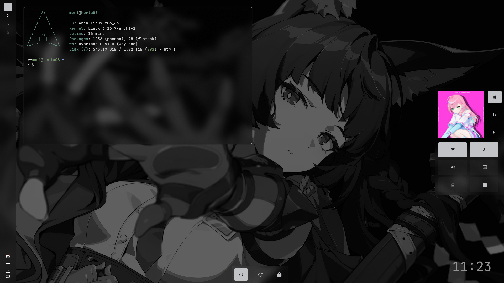

# hertaOS
my personal Hyprland + EWW dotfiles

### Requirements
- [hyprland](https://github.com/hyprwm/Hyprland)
- [EWW](https://github.com/elkowar/eww)
- [hyprlock](https://github.com/hyprwm/hyprlock)
- [hyprshot](https://github.com/Gustash/hyprshot)
- JetBrains Nerdfont Mono
- [Hyprpaper](https://github.com/hyprwm/hyprpaper) (optional, disabled by default)

## Screenshots

(normal)

(hovered)

### Applications that I recommend to use together
- Notification Daemon : [dunst](https://github.com/dunst-project/dunst)
- Application Launcher : [Vicinae](https://github.com/vicinaehq/vicinae) or [Sherlock](https://github.com/Skxxtz/sherlock)
- Browser : [Zen](https://zen-browser.app) [github](https://github.com/zen-browser/desktop) or [Floorp](https://floor.app) [github](https://github.com/Floorp-Projects/Floorp)

## Observations

### !! CONFIGURE YOUR MONITOR FIRST ON hyprland.conf !! (by default its using a 1920x1080 monitor with 180hz being refered as "HDMI-A-1".)

Wallpaper is handled by EWW, but hyprpaper config exists, just add it to exec-now on hyprland.conf, hyprpaper searches for the wallpaper on .config/hypr/assets/wallpaper.png
obs: EWW searches for "wallpaper.png" on (eww config)/assets/wallpaper.png
