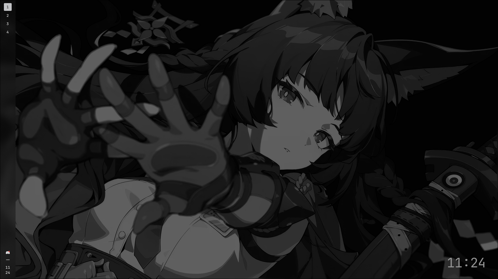
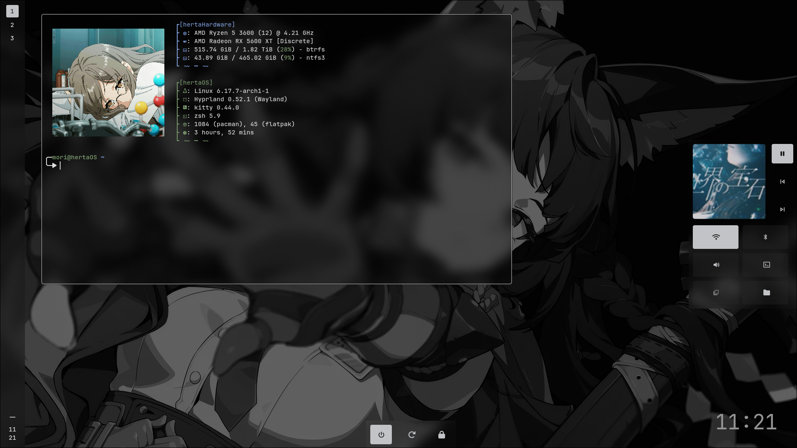

# hertaOS dotfiles
my personal Hyprland + EWW dotfiles

### Requirements
- [hyprland](https://github.com/hyprwm/Hyprland)
- [EWW](https://github.com/elkowar/eww)
- [hyprlock](https://github.com/hyprwm/hyprlock)
- `hyprland-workspaces` package from AUR
- JetBrains Nerdfont Mono
- [Hyprshot](https://github.com/Gustash/hyprshot)
- [dunst](https://github.com/dunst-project/dunst) (or just change it)

## Screenshots

(expanded)

### Applications that I recommend using together
- Application Launcher : [Vicinae](https://github.com/vicinaehq/vicinae) or [Sherlock](https://github.com/Skxxtz/sherlock)
- Browser : [Zen](https://zen-browser.app) ([github](https://github.com/zen-browser/desktop)) or [Floorp](https://floor.app) ([github](https://github.com/Floorp-Projects/Floorp))
- Anime : [curd](https://github.com/Wraient/curd) (TUI scraper using anilist, also supports tracking) or [Hayase](https://hayase.watch) (bittorrent client, formerly miru)

## TODO List

- Rewrite nuno shell to an better framework like [Fabric](https://github.com/Fabric-Development/fabric/) (GTK / Python) or [Quickshell](https://quickshell.org/) (QT / QML)
- Improve the design, while also maintaining the "modern" aesthetic
  
- Feature: Settings window, wallpaper switch and an option to use colors set based on your wallpaper (eg. [cwal](https://github.com/nitinbhat972/cwal), [Matugen](https://github.com/InioX/matugen) or [wallust](https://codeberg.org/explosion-mental/wallust))

## Observations

#### !! CONFIGURE YOUR MONITOR FIRST ON hyprland.conf !! (by default its using a 1920x1080 monitor with 180hz being refered as "HDMI-A-1".)

Wallpaper is handled by EWW, with the wallpaper being set on ~/.config/nuno-shell/assets/wallpaper.png (I recommend changing to [awww (formerly known as swww)](https://codeberg.org/LGFae/awww))

also, EWW power menu on the bottom of the screen comes disabled by default, and it lacks a confirmation prompt for now. Hyprland auto executes EWW on launch via the script on /hypr/scripts/eww.sh

## Acknowledgements

Mitsukiyuki (one of the fastfetch images) is the property of [Moondrop](https://moondroplab.com/en/drawing)
