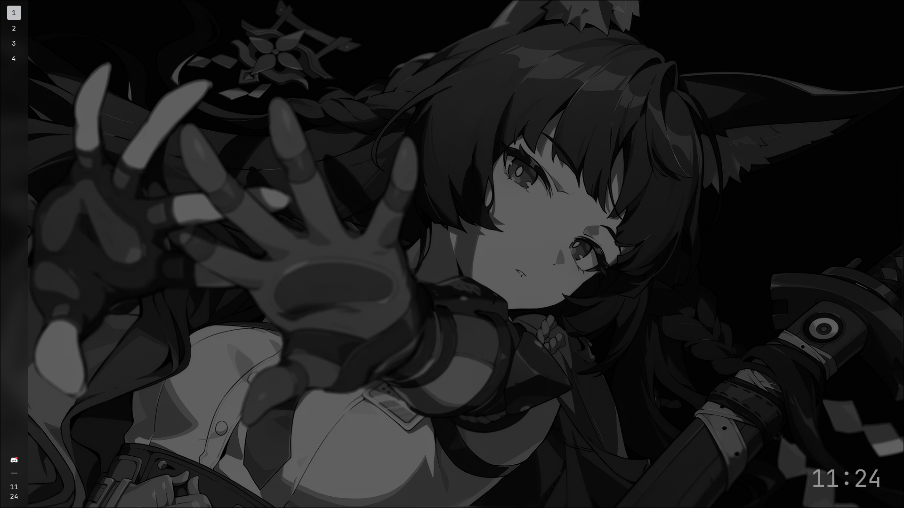

# dotfiles
my personal Hyprland dotfiles

!! CONFIGURE YOUR MONITOR FIRST ON hyprland.conf !! (by default its using a 1920x1080 monitor with 180hz being refered as "HDMI-A-1".)

Uses hyprshot, hyprland, JetBrains Nerdfont Mono, and EWW.

obs: EWW searches for "wallpaper.png" on (eww config)/assets/wallpaper.png

(normal)

(hovered)

Wallpaper is handled by EWW, but hyprpaper config exists, just add it to exec-now on hyprland.conf, hyprpaper searches for the wallpaper on .config/hypr/assets/wallpaper.png
